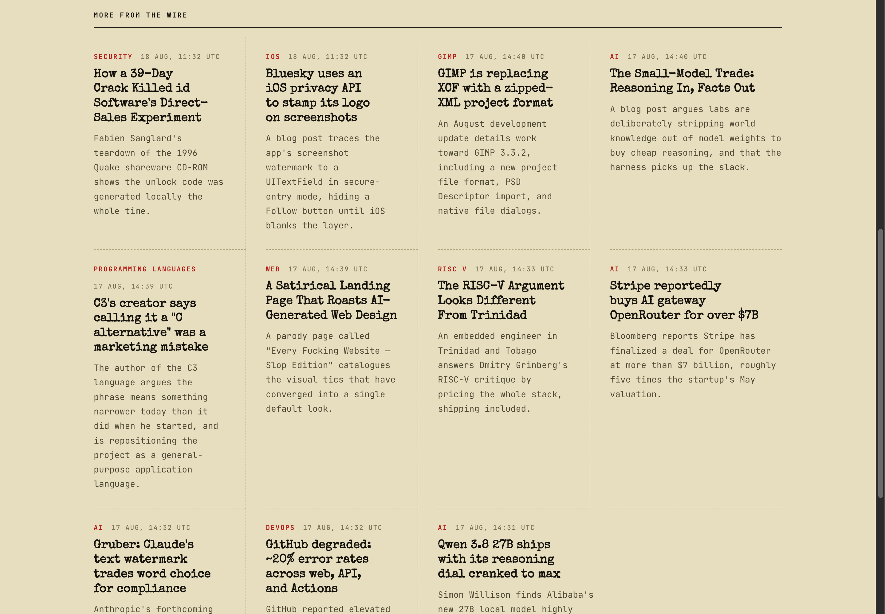
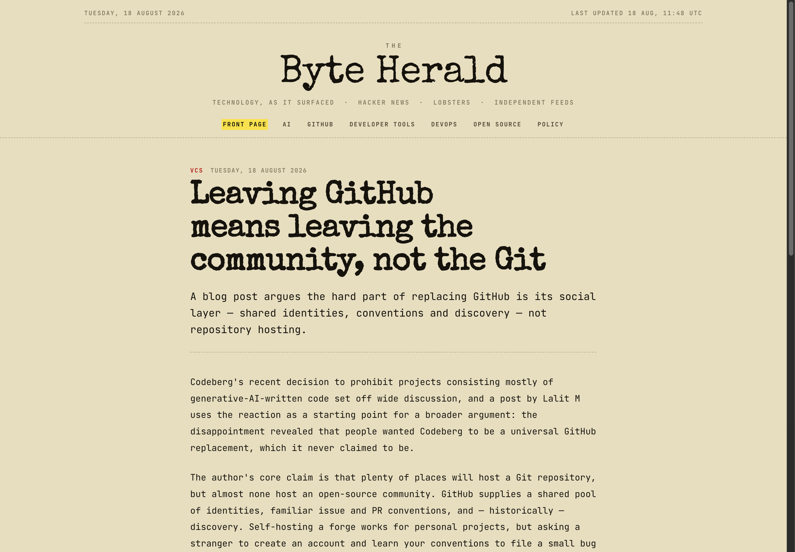
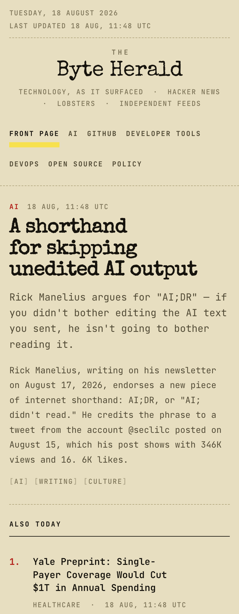

# The Byte Herald

A newspaper that writes itself.

**[byteherald.pages.dev](https://byteherald.pages.dev)**



## What this is

Every few hours a program looks at what people are actually talking about on Hacker
News, Lobsters and a handful of independent tech feeds. It opens the articles behind
those discussions, reads them, and writes a short report on the ones that mattered.
Then it publishes.

No human writes, edits or approves any of it.

## Why it exists

Plenty of tools summarise headlines. The interesting question is whether an agent can
run the whole thing end to end — decide *what deserves attention*, read the actual
source rather than the title, and produce something a person would genuinely read.
That means solving the unglamorous parts:

- **Judgement.** Which of 90 stories are worth writing about, and which one leads?
- **Substance.** Reading the linked article, not paraphrasing its headline.
- **Honesty.** Saying "the source is thin here" instead of padding, linking every
  source, and never inventing a fact or a byline.
- **Restraint.** Not looking like a content farm.

The design leans into the tension rather than hiding it: machine-written copy set in
a typewriter face on paper stock, with the automation disclosed on every page.

## What it's for

If you read Hacker News but not thoroughly, this is a way to catch what mattered
today with a link straight to the primary source.

If you're building agent pipelines, this is a complete working one — sourcing,
ranking, generation with validation, static publishing — small enough to read in an
afternoon.

It is deliberately **not** a content farm. Fewer, better posts beat volume, and
that's a design constraint, not a nice-to-have.



## How it works

```
Hacker News ─┐
Lobsters ────┤─▶ ingest ─▶ rank ─▶ write ─▶ export ─▶ build
RSS feeds ───┘      │        │       │        │        │
                 fetch    score    Claude   JSON     Astro
                 article  +dedupe  writes           static
                 text                              output
```

**Ingest** collects candidates into SQLite and fetches the linked article text.
Failures are recorded per URL so a broken link is never refetched.

**Rank** scores engagement × freshness × substance, normalised per source, then
drops duplicates and caps how many stories any one source can contribute.

**Write** sends the story plus its article text to Claude and validates what comes
back — a draft with no tags or no sources is rejected rather than published.

**Export + build** dumps posts to JSON and Astro builds a static site from it.

## Running it

Needs [Bun](https://bun.sh).

```bash
bun install
bun run pipeline    # ingest → write → export
bun run preview     # look at it on localhost:4321
bun run publish     # do everything and deploy
```

The writer picks a backend automatically: the Anthropic API if `ANTHROPIC_API_KEY`
is set (~$0.01–0.02/post), otherwise the local Claude Code CLI (~$0.08/post, no key
needed). Override with `WRITER=api|claude-cli|placeholder`.

## Built with

Bun, SQLite, Astro, Claude. Self-hosted type (Special Elite, JetBrains Mono), no
external requests, no tracking, no JavaScript shipped to the reader.



## Honest limitations

- **Nothing is reviewed before it publishes.** Automated writing can misread a
  source or sound more certain than the evidence supports. Every post links its
  sources for exactly that reason — follow them if a detail matters.
- **Ars Technica extraction returns nothing** — their pages are JS-rendered.
- **No scheduling yet.** `bun run publish` is manual; automating it in the cloud
  needs an API key and moving the database to D1.
- **No pagination.** The front page will get long past ~25 posts.

`trace.md` is the full working log — every decision and every bug, including the
embarrassing ones.

---

Created by **Harsh Kumar** ([@thisisharsh7](https://github.com/thisisharsh7)).
Written by Claude.
